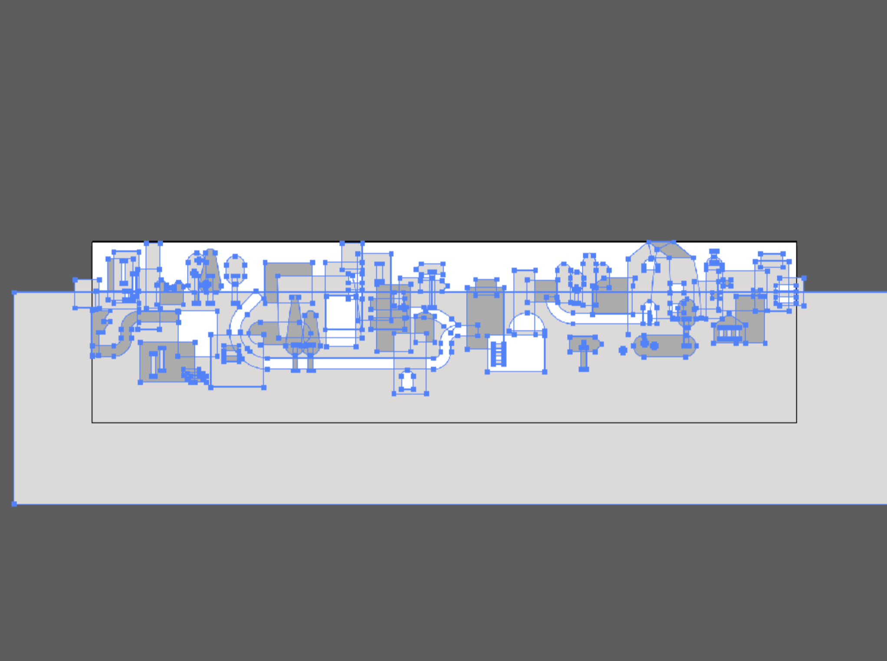
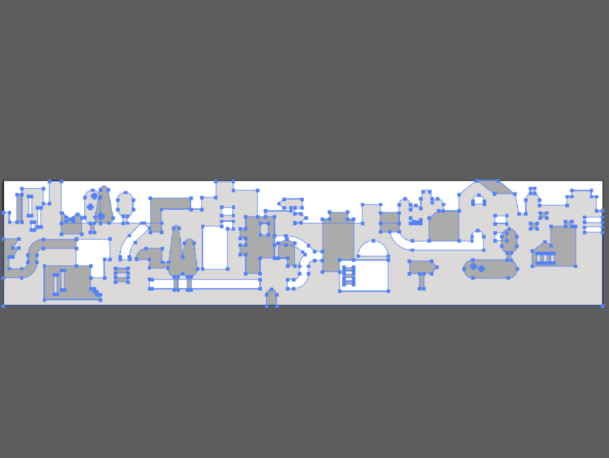
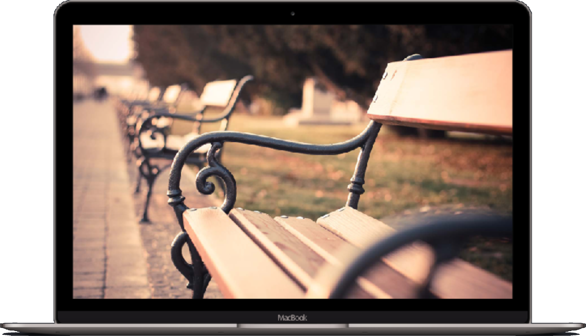
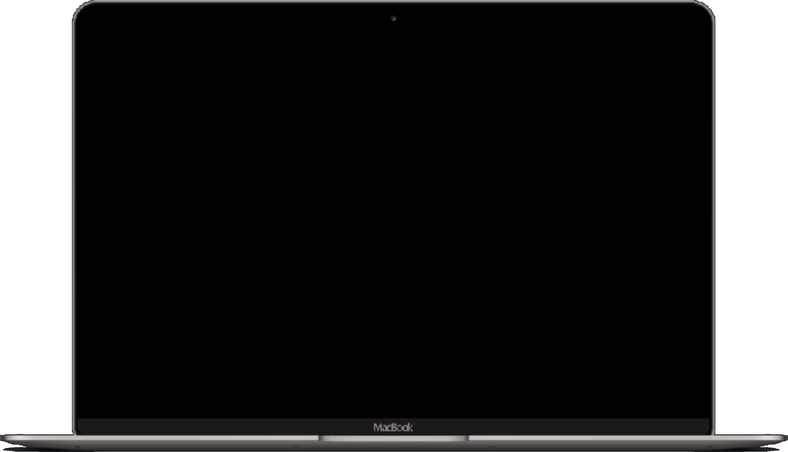

# Image optimization

## An example of cut jpeg images

You can attach an image as (**file size 14.79Mb**):

```html

```

Or you can apply the image as (**file size 301.54Kb + 4Kb**):

```html
<svg xmlns="http://www.w3.org/2000/svg" xmlns:xlink="http://www.w3.org/1999/xlink" version="1.1" viewBox="0 0 100 100">
  <defs>
    <clipPath id="clip-mask">
      <circle cx="50" cy="50" r="50" fill="black" />
    </clipPath>
  </defs>

  <image
    width="100%"
    height="100%"
    preserveAspectRatio="xMinYMin slice"
    xlink:href="./guitar/guitar.jpg"
    clip-path="url(#clip-mask)"
  />
</svg>
```

#### !!! The result of these operations will be the same ([example html file](guitar/index.html))

## An example of a damn svg export solution

First image – before fix svg. Second image – after fix svg. **Fewer dots mean less file weight**

###### Before image fix


###### After image fix


## Wireframe example



###### Weight of this image is **2.81Mb**

**But you can use absolute position and use two smaller images**


###### Weight of this image is **117.06Kb**


###### Weight of this image is **843.9Kb**

After using these two images with some CSS styles, you will save **21.5Mb**

## Helpful for image optimization

### What you need to remember?

* **PNG** - clip arts
* **JPEG** - photo, banners (always progressive)
* **GIF** - small images with animation

### Useful links

* [SQUOOSH.APP](https://squoosh.app)
* [Formulas for Photoshop blending](http://www.deepskycolors.com/archive/2010/04/21/formulas-for-Photoshop-blending-modes.html)
* [Exploring ways to export clean .svg icons with Sketch](https://medium.com/sketch-app-sources/exploring-ways-to-export-clean-svg-icons-with-sketch-the-correct-way-752e73ec4694)
* [The Different Ways of Getting SVG Out of Adobe Illustrator](https://css-tricks.com/illustrator-to-svg/)

### Images optimization utilities

* [gifsicle](http://www.lcdf.org/gifsicle/)
* [jpegtran](http://jpegclub.org/jpegtran/)
* [optipng](http://optipng.sourceforge.net)
* [svgo](https://github.com/svg/svgo)
* [svgo-gui](https://github.com/svg/svgo-gui)
* [imageoptim](https://imageoptim.com/mac)
